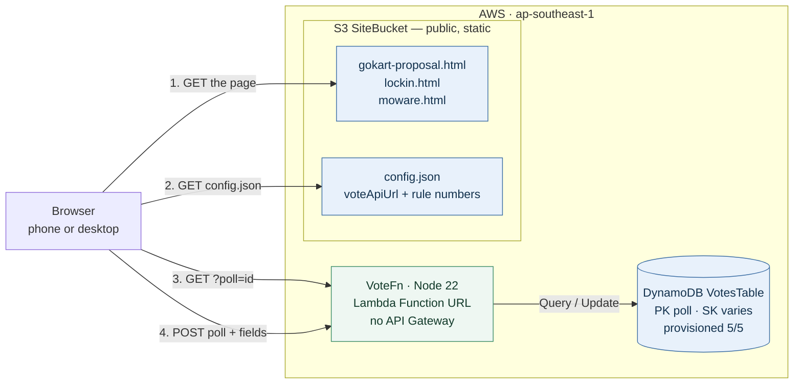
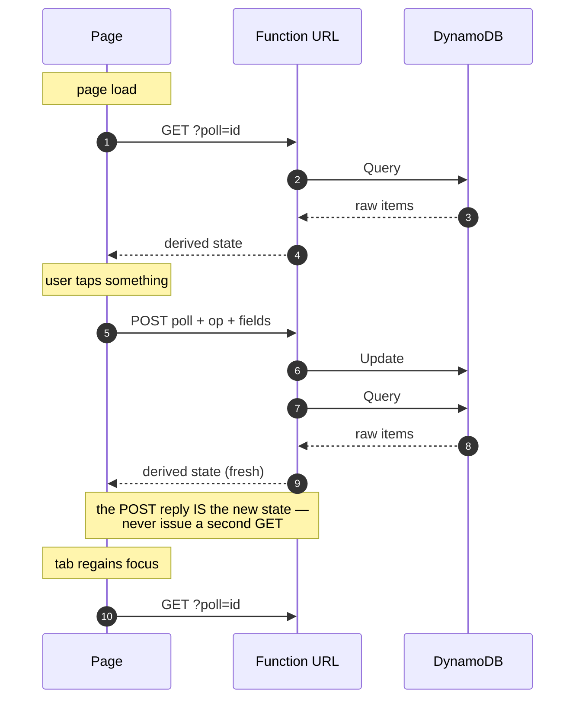

# Personal plans site

A tiny, reusable pattern for **"share a link → people interact → you see live results"** —
polls, RSVPs, trackers, small planners — hosted for **~RM0/month**.

Instead of spinning up a new app each time, every use case is one static HTML page dropped
into `plan/`, backed by one shared serverless API. Write a page, deploy, share the HTTPS
link. That's the whole workflow.

## The idea (the "to-go" concept)

Reach for this when all of these hold: the audience is small (friends/family/team), the
content is mostly a static page with one or two interactive actions on top, "live" means
*fresh on load/action* (not sub-second push), and the budget must round to zero. It is
**not** for public scale, real-time chat, or anything needing real auth/PII.

Adding a use case = drop `whatever.html` in `plan/`, pick an id, reuse the API, deploy.
The generalized recipe is in **[PLAYBOOK.md](PLAYBOOK.md)**.

## Cloud architecture

One CDK stack (`Site`), deployed to `ap-southeast-1`:



The four numbered steps are the entire client lifecycle: fetch the page, discover the
endpoint, read state, write state. Step 2 is why endpoints are never hard-coded.

**Reads and writes both return the same shape** — so a mutation needs no follow-up fetch:



| Layer | Choice | Why, not the alternative |
|---|---|---|
| Hosting | **S3** public static website | CloudFront/Amplify add cost/complexity for near-zero traffic |
| Content sync | CDK **`BucketDeployment`** | Deploy is the source of truth — no manual `aws s3 cp`; also generates `config.json` |
| API | Lambda **Function URL** | Free *indefinitely* at this scale; API Gateway's free tier is 12-months-then-billed |
| Data | **DynamoDB**, single table, provisioned 5/5 | Stays inside the *always-free* 25 RCU/WCU; `(poll, sort-key)` keeps every use case multi-tenant in one table |

- **`config.json` is the only coupling** between page and backend: it's generated at deploy
  time with the resolved Function URL (and the shared rule numbers from
  `cdk/lambda/lockin-config.json`), and pages fetch it at runtime — endpoints are never
  hard-coded.
- **Event-based, no polling:** pages fetch state only on load, on their own POST response
  (the mutation reply *is* the fresh state), and on tab refocus. No timers, no WebSockets.
- **Cost discipline:** always-free tiers only (Lambda 1M req/mo, DynamoDB 25 provisioned
  RCU/WCU, 100 GB/mo egress); `RemovalPolicy.DESTROY` + auto-delete so a forgotten stack
  still costs nothing.

Full detail: **[cdk/ARCHITECTURE.md](cdk/ARCHITECTURE.md)**.

## What's in here

### The three sites

Each is one self-contained HTML file, sharing the same Lambda and the same DynamoDB table —
kept apart by a `poll` id, so a new use case is a new file and a new id, nothing more.

| Page | `poll` id | What it is |
|---|---|---|
| **`plan/gokart-proposal.html`** | per-poll | A friends' go-kart poll — pick a date and a track, see everyone's votes laid out as a starting grid. |
| **`plan/lockin.html`** | `lockin` | *Lock In* — a private habit tracker. Prayer, sober and workout streaks with progress rings, a permanent medal bank, and an urge tool that prescribes push-ups. |
| **`plan/moware.html`** | `moware` | *Moware* ("money aware") — a private spend tracker. Log a purchase with category and remarks, see where the month went on a donut and a receipt-tape ledger. |

The two trackers are single-user and private; the poll is meant to be shared. None of them
have auth — see [cdk/ARCHITECTURE.md](cdk/ARCHITECTURE.md) for that trade-off.

### The rest

- **`cdk/`** — the stack (`lib/site-stack.ts`), the single Lambda (`lambda/index.mjs`), the
  pure unit-tested derivation modules (`lambda/tracker.mjs` for Lock In, `lambda/moware.mjs`
  for Moware), and Lock In's shared rule config (`lambda/lockin-config.json`).
- **`docs/superpowers/`** — the specs and implementation plans behind each feature.

```
plan/            static pages (one file per use case)
cdk/lambda/      Lambda handler + pure derivation logic + config + node:test suite
cdk/lib/         the CDK stack
docs/superpowers/ specs & plans
```

## Deploy

```bash
cd cdk
npm test           # node:test suite for the derivation logic
npm run deploy     # sync pages + backend; prints BaseUrl and VoteApiUrl
npm run destroy    # tear everything down
```

Share the **HTTPS object URL** — `https://<bucket>.s3.<region>.amazonaws.com/<page>.html`
(the S3 *website* endpoint is HTTP-only).

## Trade-offs (accepted by design)

The endpoint is public and unauthenticated — anyone with the link can read or write. That's
fine for a private share link at friends scale; it's the deliberate price of the zero-cost,
zero-maintenance property. If a use case ever needs auth, real-time push, or public scale,
that's the signal to swap the whole pattern (Cognito, WebSocket API Gateway, CloudFront +
on-demand DynamoDB), not to bolt it onto this one.
