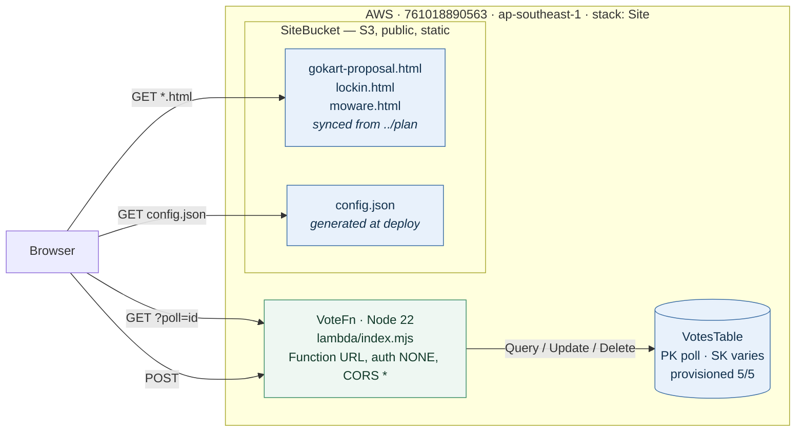
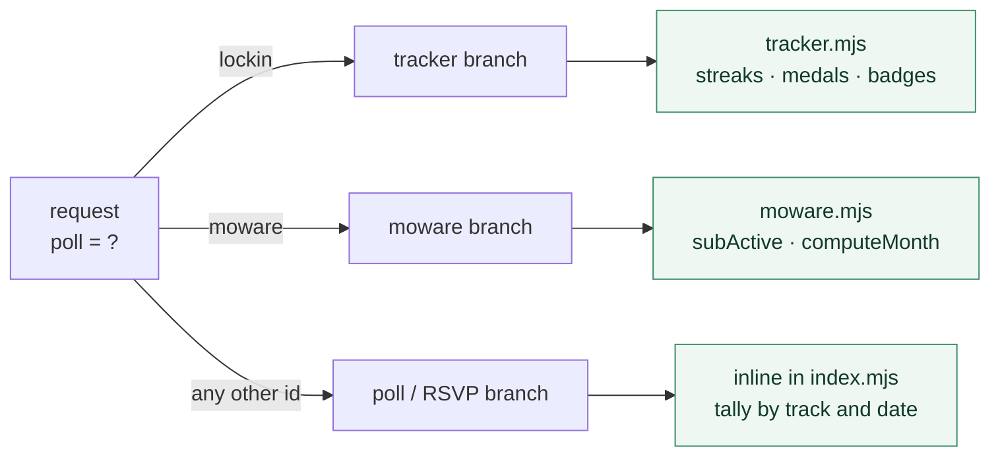
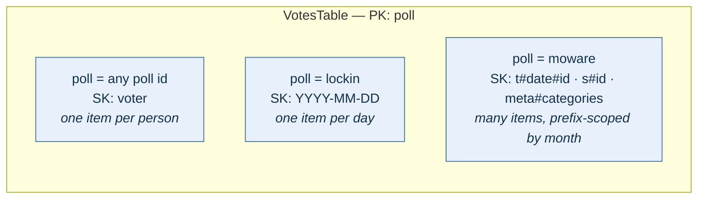

# Architecture

Static pages with one shared event-based backend — a poll, a habit tracker and a spend
tracker, kept apart by a `poll` id. One CDK stack (`Site`), account `761018890563`,
region `ap-southeast-1`.

This describes *this deployment*. For the generalized, reusable pattern behind
it — and how to apply it to a different use case — see [../PLAYBOOK.md](../PLAYBOOK.md).



One handler serves all three use cases, branching on the `poll` id — and each branch owns a
pure, unit-tested derivation module:



The single table is multi-tenant by partition, and each tenant chooses its own sort-key
shape — which is the decision that actually differs per use case:



## Components

| Resource | Purpose | Notes |
|---|---|---|
| `SiteBucket` (S3) | Serves every top-level `*.html` from `../plan/` | Public bucket policy, ACLs blocked; `DESTROY` + auto-delete |
| `BucketDeployment` | Syncs pages + generates `config.json` on deploy | Prune on: deleted local files leave the bucket |
| `VoteFn` (Lambda) | One handler in `lambda/index.mjs`, branching on `poll` id | Function URL (auth NONE, CORS `*`) — no API Gateway |
| `VotesTable` (DynamoDB) | Keyed `(poll, voter)`; the sort key's meaning is per-tenant (see above) | Provisioned 5/5 RCU/WCU |

`config.json` is the only coupling between page and backend: it's written at deploy
time with the resolved Function URL, and pages fetch it at runtime. Pages never
hard-code endpoints.

## API

Every branch answers `GET` with current state and `POST` with the *same shape* recomputed —
so a write never needs a follow-up read.

| `poll` | `GET` | `POST` |
|---|---|---|
| any poll id | `{ votes[], tracks{}, dates{} }` | `{poll, voter, track, dates[]}` → upsert |
| `lockin` | `{ days[], today, summary }` | one day's ticks (today or yesterday MYT only) |
| `moware` | `{ month, today, categories, subs, summary }` | `op`: `txn` / `delTxn` / `sub` / `cancelSub` |

Shared item semantics:

- **Upserts, not appends**, wherever there's one item per actor or per day — re-voting or
  re-ticking updates in place and never duplicates.
- `createdAt` via `if_not_exists` → the poll's grid position (first-voter order) is permanent.
- The `poll` partition makes the table multi-tenant: a new page reuses the same API with a
  new id, and unrelated use cases can never collide.
- **Aggregates are never stored.** Streaks, medals, monthly totals and category splits are all
  derived from raw items on read, by the pure module for that branch.
- **Reserved words bite here.** `treat` is a DynamoDB reserved keyword and must be aliased via
  `ExpressionAttributeNames`, as `name` already is — a bare one throws `ValidationException`
  at runtime and is invisible to the test suite. `index.test.mjs` carries a guard and the
  probe command for checking a new attribute name.

## Event-based updates (no polling)

The page fetches state only on discrete events:

1. **Page load** — `GET` after resolving `config.json`
2. **After voting** — the `POST` response carries fresh state (no second request)
3. **Tab refocus** — `visibilitychange` listener re-fetches

No timers, no WebSockets. Staleness between events is accepted by design; a
friends-scale poll doesn't justify push infrastructure.

## Cost

Everything sits in always-free tiers: Lambda (1M req/mo), DynamoDB (25 provisioned
RCU/WCU), data transfer (first 100 GB/mo). S3 storage/requests for a few HTML files
round to RM0. Function URL instead of API Gateway avoids the only per-request charge
that would outlive the 12-month free tier.

## Trade-offs (accepted)

- Endpoint is public and unauthenticated — anyone with the link can read or write any
  tenant: overwrite a vote by name, tick a habit, or log a spend. Accepted for a private
  share link; for the spend log it was a considered decision rather than an inherited one
  (see the Moware spec's "Accepted risk"). The mitigation, if ever needed, is a
  shared-secret header — not Cognito.
- S3 website endpoint is HTTP-only; share the HTTPS object URL
  (`https://<bucket>.s3.<region>.amazonaws.com/<page>.html`) instead.
- `Scan`-free but `Query`-per-request reads: state is recomputed on every call.
  Trivial at this scale.

## Deploy

```bash
npm run deploy    # sync pages + backend; prints BaseUrl and VoteApiUrl
npm run destroy   # removes everything, including bucket contents
```

Lambda or page changes both ship through the same deploy.
